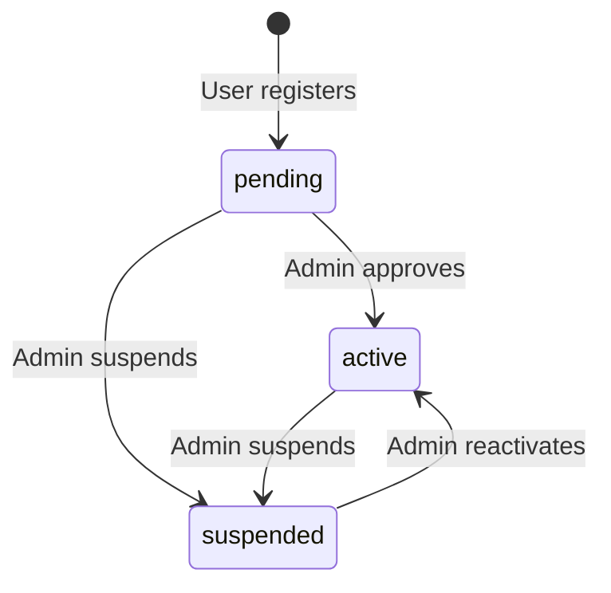

# Data Model: Users Management

**Feature**: `004-users-management`
**Date**: 2026-06-18
**Source**: `spec.md` + `research.md`

---

## Domain Types

### `UserRole`

```typescript
export type UserRole = 'admin' | 'driver' | 'serviceProvider';
```

**Notes**: Based on the Assumptions section in the spec. These three roles cover all actors in the "On The Way" system.

---

### `UserStatus`

```typescript
export type UserStatus = 'active' | 'suspended' | 'pending';
```

**Notes**: Covers the standard user lifecycle states defined in the spec Assumptions.

---

### `User`

```typescript
export interface User {
  id: string;
  name: string;
  email: string;
  role: UserRole;
  status: UserStatus;
  trustScore: number;       // 0–100, displayed as a percentage (e.g., 95 → "95%")
  joinedAt: string;         // ISO 8601 date-time
  avatarUrl?: string;       // optional profile image
}
```

**Key constraints**:
- `trustScore` is server-computed and read-only from the admin perspective.
- `email` must be unique across all users.
- `id` is the canonical identity used for routing to `/users/:id`.

---

### `UserActivity`

```typescript
export type UserActivityType =
  | 'reportSubmitted'
  | 'reportVerified'
  | 'helpRequestCreated'
  | 'helpRequestResolved'
  | 'profileUpdated'
  | 'suspended'
  | 'reactivated';

export interface UserActivity {
  id: string;
  userId: string;
  type: UserActivityType;
  description: string;
  timestamp: string;        // ISO 8601 date-time
  relatedEntityId?: string; // e.g., report ID or help request ID
  relatedEntityRoute?: string;
}
```

---

### `UserDetails`

```typescript
export interface UserDetails extends User {
  phone?: string;
  address?: string;
  vehicleInfo?: string;     // relevant for 'driver' role
  activityHistory: UserActivity[];
}
```

---

## Query Param Types

### `UsersQueryParams`

```typescript
export interface UsersQueryParams {
  page: number;             // 1-indexed
  pageSize: number;         // default: 10
  search?: string;          // searches name and email
  role?: UserRole;          // filter by role
  status?: UserStatus;      // filter by status
}
```

---

## Paginated Response Wrapper

```typescript
export interface PaginatedResponse<T> {
  data: T[];
  total: number;            // total number of matching records
  page: number;
  pageSize: number;
  totalPages: number;
}

export type UsersListResponse = PaginatedResponse<User>;
```

**Notes**: A generic `PaginatedResponse<T>` wrapper is introduced so it can be reused for future paginated features (reports, providers).

---

## State Transitions



**Notes**: State transitions are read-only from Phase 4's scope. Actions (suspend, reactivate) are scoped to a future moderation or user-details action feature.

---

## Entity Relationships

```
User 1 ──< UserActivity (one user has many activity events)
User is referenced by: Reports, HelpRequests, ServiceProviders (future phases)
```
