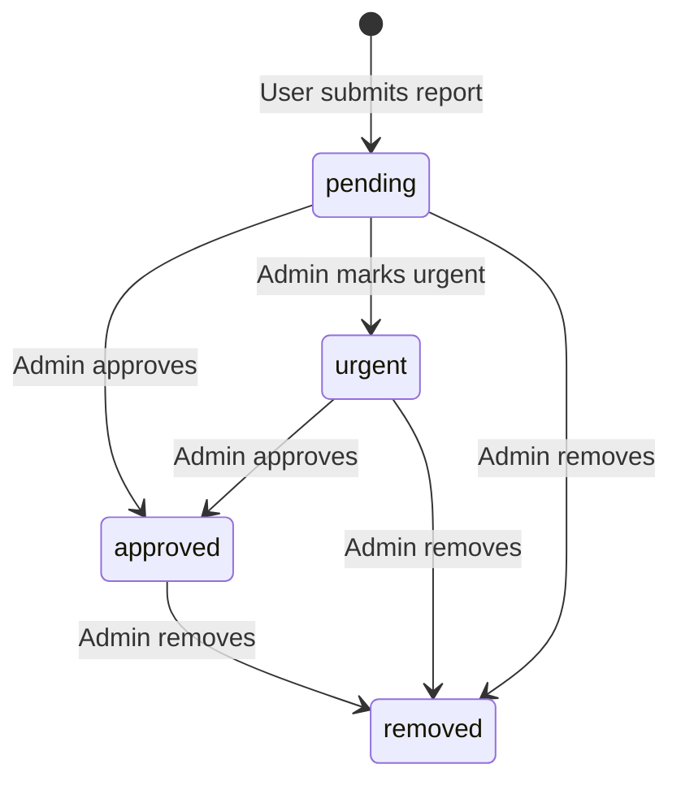

# Data Model: Reports & Obstacles Management

**Feature**: `005-reports-obstacles-management`
**Date**: 2026-06-19
**Source**: `spec.md` + `research.md`

---

## Domain Types

### `ObstacleType`

```typescript
export type ObstacleType =
  | 'pothole'
  | 'roadDebris'
  | 'trafficLight'
  | 'accident'
  | 'roadClosure'
  | 'fog';
```

**Notes**: Fixed enumeration provided by the backend. Adding new types is out of scope for Phase 5. Display labels (e.g., `"Pothole"`, `"Road Debris"`) are derived client-side via a lookup map.

---

### `ReportStatus`

```typescript
export type ReportStatus = 'pending' | 'urgent' | 'approved' | 'removed';
```

**Notes**: Represents the combined moderation state and urgency level. A report moves from `pending` to `approved`, `urgent`, or `removed` via admin actions.

---

### `RemovalReason`

```typescript
export type RemovalReason = 'spam' | 'inaccurate' | 'inappropriate';
```

**Notes**: Mandatory when removing a report. Confirmed in clarification session 2026-06-19. Sent as a field in the DELETE/PATCH request body.

---

### `ReportSubmitter`

```typescript
export interface ReportSubmitter {
  id: string;
  name: string;
  isDeleted: boolean; // true when the account no longer exists
}
```

**Notes**: When `isDeleted` is `true`, the UI renders the name as `"Deleted User"` and disables the profile link. Confirmed in clarification session 2026-06-19.

---

### `CommunityVotes`

```typescript
export interface CommunityVotes {
  upvotes: number;
  downvotes: number;
}
```

---

### `GpsCoordinates`

```typescript
export interface GpsCoordinates {
  lat: number;
  lng: number;
}
```

**Notes**: Optional on a report. When absent or unparseable, the map widget is replaced with a "Location unavailable" placeholder.

---

### `Report` (list item)

```typescript
export interface Report {
  id: string;
  title: string;
  obstacleType: ObstacleType;
  status: ReportStatus;
  location: string;          // Human-readable street address
  submittedAt: string;       // ISO 8601 date-time
  votes: CommunityVotes;
  submitter: ReportSubmitter;
}
```

**Notes**: Used in the paginated reports list. Omits heavy fields (images, full description, coordinates) for performance.

---

### `ReportDetails`

```typescript
export interface ReportDetails extends Report {
  description: string;
  imageUrls: string[];       // May be empty; hosted URLs returned by backend
  gpsCoordinates: GpsCoordinates | null;
  removalReason?: RemovalReason; // Set only when status === 'removed'
}
```

**Notes**: Extends `Report` with the full context needed for the details page: description, image gallery, and map coordinates.

---

## Query Param Types

### `ReportsQueryParams`

```typescript
export interface ReportsQueryParams {
  page: number;              // 1-indexed
  pageSize: number;          // default: 10
  search?: string;           // searches location text and description
  obstacleType?: ObstacleType;
  status?: ReportStatus;
}
```

---

## Paginated Response

Reuses the existing generic wrapper from `src/types/users.ts`:

```typescript
// Already defined — do NOT redefine
export type ReportsListResponse = PaginatedResponse<Report>;
```

---

## Mutation Payloads

### Approve Report
```typescript
// POST /admin/reports/:id/approve
// No request body required
```

### Mark as Urgent
```typescript
// POST /admin/reports/:id/mark-urgent
// No request body required
```

### Remove Report
```typescript
// DELETE /admin/reports/:id
// Request body:
export interface RemoveReportPayload {
  reason: RemovalReason; // 'spam' | 'inaccurate' | 'inappropriate'
}
```

### Flag User
```typescript
// POST /admin/reports/:id/flag-user
// No request body required (flags the report's submitter)
```

---

## State Transitions



**Notes**: "Mark as Urgent" acts as a priority escalation; it does not prevent subsequent Approve or Remove actions. Once removed, no further transitions are possible from the admin UI (the record is soft/hard deleted on the backend).

---

## Entity Relationships

```
Report 1 ──< imageUrls[]      (one report has zero or more image URLs)
Report 1 ──  GpsCoordinates   (optional; null when not provided)
Report 1 ──  ReportSubmitter  (nullable/deleted reference to User)
Report 1 ──  CommunityVotes   (embedded vote counts)

Report is referenced by:
  - User (as submitter)
  - FlagUser action → creates a flag record linked to User (Phase 7)
```

---

## Zod Validation Schemas

### Removal Form Schema

```typescript
import { z } from 'zod';

export const removeReportSchema = z.object({
  reason: z.enum(['spam', 'inaccurate', 'inappropriate'], {
    required_error: 'Please select a reason for removal.',
  }),
});

export type RemoveReportFormValues = z.infer<typeof removeReportSchema>;
```

**Notes**: Used in `RemoveReportDialog` with React Hook Form to validate the dropdown selection before enabling the confirm button.
