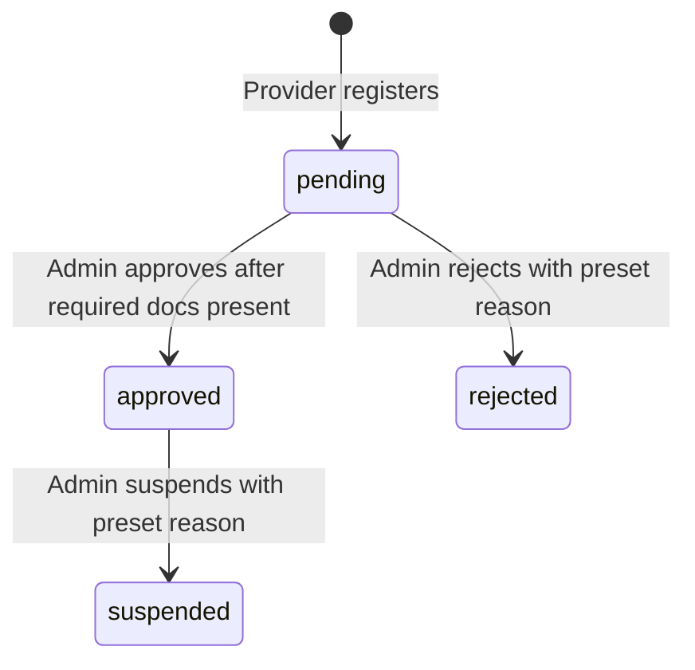

# Data Model: Service Providers

**Feature**: `006-service-providers`  
**Date**: 2026-06-21  
**Source**: `spec.md` + `research.md`

---

## Domain Types

### `ProviderServiceType`

```typescript
export type ProviderServiceType =
  | 'towing'
  | 'medical'
  | 'fuel'
  | 'mechanic'
  | 'other';
```

**Notes**: Minimum categories from the spec are Towing, Medical, and Fuel. Additional categories are supported without changing the list UI.

---

### `ProviderStatus`

```typescript
export type ProviderStatus = 'pending' | 'approved' | 'rejected' | 'suspended';
```

**Notes**: `approved` means immediately visible and available to drivers. `suspended` removes the provider from active availability without deleting history.

---

### `VerificationStatus`

```typescript
export type VerificationStatus = 'missingRequired' | 'readyForReview' | 'verified';
```

**Notes**: Derived from required document presence and administrative status. A pending provider with all required documents is `readyForReview`; an approved provider is `verified`.

---

### `VerificationDocumentType`

```typescript
export type VerificationDocumentType =
  | 'businessLicense'
  | 'providerIdentity'
  | 'serviceEligibilityProof'
  | 'other';
```

**Mandatory approval document types**:

- `businessLicense`
- `providerIdentity`
- `serviceEligibilityProof`

---

### `VerificationDocument`

```typescript
export interface VerificationDocument {
  id: string;
  type: VerificationDocumentType;
  name: string;
  uploadedAt: string; // ISO 8601 date-time
  isMandatory: boolean;
  isAvailable: boolean;
  previewUrl?: string;
}
```

**Validation rules**:

- Approval is blocked unless all mandatory document types are present and `isAvailable === true`.
- Missing or unavailable documents render in the details page as blocking approval requirements.

---

### `ProviderRatingSummary`

```typescript
export interface ProviderRatingSummary {
  averageRating: number | null;
  reviewCount: number;
}
```

**Notes**: `averageRating: null` represents an unrated provider and renders as an unrated state instead of `0`.

---

### `CustomerReview`

```typescript
export interface CustomerReview {
  id: string;
  reviewerName: string | null;
  rating: number; // 1-5
  comment: string;
  reviewedAt: string; // ISO 8601 date-time
}
```

**Validation rules**:

- `rating` must be between 1 and 5.
- `reviewerName: null` renders as an anonymized customer label.

---

### `Provider`

```typescript
export interface Provider {
  id: string;
  businessName: string;
  serviceType: ProviderServiceType;
  status: ProviderStatus;
  verificationStatus: VerificationStatus;
  rating: ProviderRatingSummary;
  operatingArea: string;
  primaryContactName?: string;
  phone?: string;
  email?: string;
}
```

**Notes**: Used for the paginated providers list. It includes enough data for filtering, scanning, and navigation without loading documents/reviews for every row.

---

### `ProviderDetails`

```typescript
export interface ProviderDetails extends Provider {
  address?: string;
  description?: string;
  documents: VerificationDocument[];
  missingRequiredDocumentTypes: VerificationDocumentType[];
  recentReviews: CustomerReview[];
  latestStatusDecision?: StatusDecision;
}
```

**Notes**: Used on `/providers/:id`. `missingRequiredDocumentTypes` powers the approval-blocking UI.

---

### `ProviderStatusAction`

```typescript
export type ProviderStatusAction = 'approve' | 'reject' | 'suspend';
```

---

### `ProviderDecisionReason`

```typescript
export type ProviderDecisionReason =
  | 'incompleteDocuments'
  | 'invalidBusinessInfo'
  | 'policyViolation'
  | 'serviceQualityConcern'
  | 'safetyConcern'
  | 'duplicateProvider';
```

**Notes**: Reject and Suspend require a preset reason. Approve does not require a reason.

---

### `StatusDecision`

```typescript
export interface StatusDecision {
  id: string;
  action: ProviderStatusAction;
  reason?: ProviderDecisionReason;
  notes?: string;
  decidedAt: string; // ISO 8601 date-time
  decidedByAdminId: string;
}
```

**Validation rules**:

- `reason` is required for `reject` and `suspend`.
- `notes` is optional and never blocks submission.

---

## Query Param Types

### `ProvidersQueryParams`

```typescript
export interface ProvidersQueryParams {
  page: number; // 1-indexed
  pageSize: number; // default: 10
  search?: string; // business name, contact, location text
  type?: ProviderServiceType;
  status?: ProviderStatus;
}
```

---

## Paginated Response

Reuse the existing generic paginated wrapper pattern already used by users/reports:

```typescript
export type ProvidersListResponse = PaginatedResponse<Provider>;
```

---

## Mutation Payloads

### Approve Provider

```typescript
export interface ApproveProviderPayload {
  action: 'approve';
}
```

**Rule**: Allowed only when the provider is `pending` and all mandatory approval documents are present.

### Reject Provider

```typescript
export interface RejectProviderPayload {
  action: 'reject';
  reason: ProviderDecisionReason;
  notes?: string;
}
```

**Rule**: Allowed only when the provider is `pending`.

### Suspend Provider

```typescript
export interface SuspendProviderPayload {
  action: 'suspend';
  reason: ProviderDecisionReason;
  notes?: string;
}
```

**Rule**: Allowed only when the provider is `approved`.

```typescript
export type UpdateProviderStatusPayload =
  | ApproveProviderPayload
  | RejectProviderPayload
  | SuspendProviderPayload;
```

---

## State Transitions



**Invalid transitions blocked in UI**:

- `pending -> approved` when business license, provider identity document, or service eligibility proof is missing or unavailable.
- `approved -> rejected`
- `rejected -> approved`
- `suspended -> approved` (reactivation is out of scope for this phase)

---

## Entity Relationships

```text
Provider 1 --< VerificationDocument
Provider 1 --< CustomerReview
Provider 1 --< StatusDecision
Provider 1 -- ProviderRatingSummary (embedded summary)
Provider -- ProviderServiceType (categorization)
Provider -- ProviderStatus (administrative lifecycle)
```

---

## Zod Validation Schemas

### Provider Status Action Schema

```typescript
import { z } from 'zod';

export const providerDecisionReasonSchema = z.enum([
  'incompleteDocuments',
  'invalidBusinessInfo',
  'policyViolation',
  'serviceQualityConcern',
  'safetyConcern',
  'duplicateProvider',
]);

export const rejectProviderSchema = z.object({
  reason: providerDecisionReasonSchema,
  notes: z.string().trim().max(500).optional(),
});

export const suspendProviderSchema = z.object({
  reason: providerDecisionReasonSchema,
  notes: z.string().trim().max(500).optional(),
});

export type RejectProviderFormValues = z.infer<typeof rejectProviderSchema>;
export type SuspendProviderFormValues = z.infer<typeof suspendProviderSchema>;
```

**Notes**: Approve is confirmation-only and requires no form fields. The approve button is disabled or blocked when `missingRequiredDocumentTypes.length > 0`.
