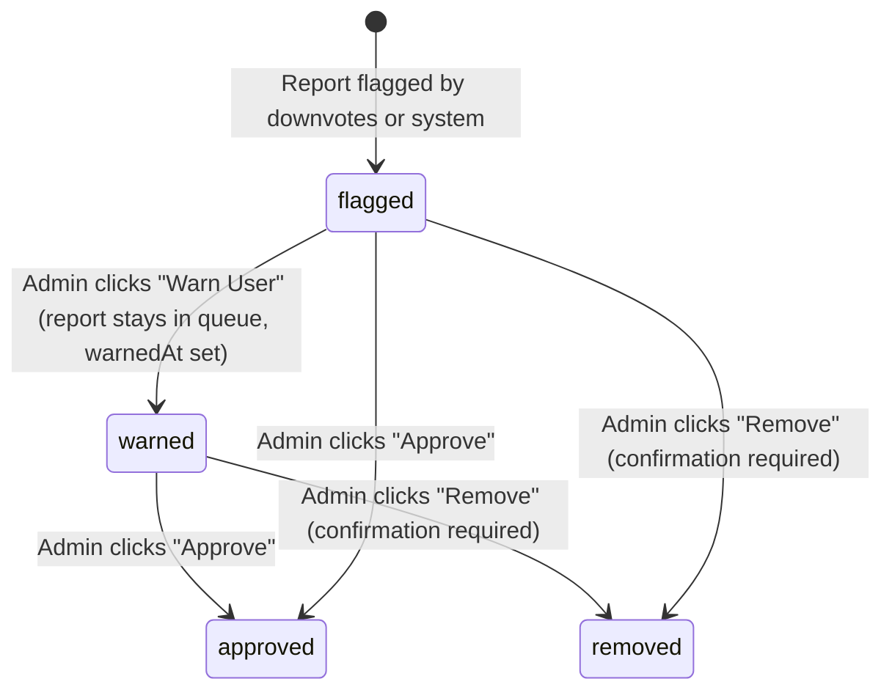

# Data Model: Moderation Panel

**Feature**: `007-moderation-panel`  
**Date**: 2026-06-24  
**Source**: `spec.md` + `research.md`

---

## Domain Types

### `ModerationReportAction`

```typescript
export type ModerationReportAction = 'approve' | 'remove' | 'warnUser';
```

**Notes**: Applied to `FlaggedReport` entries.
- `approve` — restores the report to active status, removes it from the flagged queue.
- `remove` — permanently deletes the report. Requires a single confirmation step before execution.
- `warnUser` — issues a warning to the report's author. Report remains in queue, marked "Warned".

---

### `ModerationUserAction`

```typescript
export type ModerationUserAction = 'warn' | 'suspend' | 'flagToAdmin';
```

**Notes**: Applied to `SuspiciousUser` entries.
- `warn` — increments the user's warning count; instantaneous.
- `suspend` — deactivates the user's account. Requires a single confirmation step before execution. Reinstatement is handled from `/users/:id`.
- `flagToAdmin` — escalates the case and triggers an active notification to all super-administrators; instantaneous.

---

### `FlagReason`

```typescript
export type FlagReason = 'highDownvotes' | 'reportedAsSpam' | 'duplicateContent' | 'other';
```

**Notes**: Categorized reason a report was escalated for review. Rendered as a colored badge on the flagged report entry.

---

### `FlaggedReport`

```typescript
export interface FlaggedReport {
  id: string;
  reportTitle: string;
  location: string;
  downvoteCount: number;
  flagReason: FlagReason;
  submittingUser: {
    id: string;
    displayName: string;
  };
  warnedAt: string | null; // ISO 8601 date-time; non-null means Warn User was already applied
  flaggedAt: string;       // ISO 8601 date-time
}
```

**Validation rules**:
- `warnedAt !== null` → render "Warned" badge on the entry.
- All three actions (Approve, Remove, Warn User) are available regardless of `warnedAt` state; the badge provides context, not a gate.
- `remove` requires a confirmation dialog before the mutation is dispatched.

---

### `SuspiciousUser`

```typescript
export interface SuspiciousUser {
  id: string;
  displayName: string;
  trustScore: number;        // lower = more suspicious
  reportCount: number;
  warningCount: number;
  activitySummary: string;   // e.g., "Multiple fake reports"
  flaggedAt: string;         // ISO 8601 date-time
}
```

**Validation rules**:
- `trustScore` is read-only; computed by the backend.
- `suspend` requires a confirmation dialog before the mutation is dispatched.
- All three actions (Warn, Suspend, Flag to Admin) remain available regardless of `trustScore`.

---

### `PendingModerationItem`

```typescript
export type PendingItemType = 'reportReview' | 'userFlag' | 'contentRemoval';
export type PendingItemPriority = 'high' | 'medium' | 'low';

export interface PendingModerationItem {
  id: string;
  type: PendingItemType;
  priority: PendingItemPriority;
  description: string;
  targetEntityId: string;   // report ID or user ID
  submittedAt: string;      // ISO 8601 date-time
}
```

**Notes**:
- `reportReview` items navigate to `/reports/:targetEntityId` on Review click.
- `userFlag` items navigate to `/users/:targetEntityId` on Review click.
- `contentRemoval` items show a toast ("Content removal — no detail view available in this phase") instead of navigating.

---

### `ModerationSummary`

```typescript
export interface ModerationSummary {
  totalPendingCount: number; // sum of flagged reports + suspicious users + pending queue items
}
```

**Notes**: Displayed as a badge in the page header area. Updates within 1 second of a successful moderation action (SC-003) via query invalidation.

---

### `ModerationActionPayload`

Discriminated union payload for all 6 moderation quick actions:

```typescript
// Report actions
export interface ApproveReportPayload {
  targetType: 'report';
  targetId: string;
  action: 'approve';
}

export interface RemoveReportPayload {
  targetType: 'report';
  targetId: string;
  action: 'remove';
}

export interface WarnUserOnReportPayload {
  targetType: 'report';
  targetId: string;
  action: 'warnUser';
}

// User actions
export interface WarnUserPayload {
  targetType: 'user';
  targetId: string;
  action: 'warn';
}

export interface SuspendUserPayload {
  targetType: 'user';
  targetId: string;
  action: 'suspend';
}

export interface FlagToAdminPayload {
  targetType: 'user';
  targetId: string;
  action: 'flagToAdmin';
}

export type ModerationActionPayload =
  | ApproveReportPayload
  | RemoveReportPayload
  | WarnUserOnReportPayload
  | WarnUserPayload
  | SuspendUserPayload
  | FlagToAdminPayload;
```

---

## Query Param Types

```typescript
// All moderation queries use no user-facing filters in Phase 7.
// Background polling drives freshness; no pagination in Phase 7 (bounded lists).
export interface FlaggedReportsQueryParams {
  // reserved for future filtering
}

export interface SuspiciousUsersQueryParams {
  // reserved for future filtering
}

export interface PendingModerationQueryParams {
  // reserved for future filtering
}
```

---

## State Transitions

### Flagged Report Moderation States



**Notes**: "Warned" is a sub-state of the flagged queue, not a terminal state. Reports only leave the queue on Approve or Remove.

### Suspicious User Moderation States

```mermaid
stateDiagram-v2
    [*] --> suspicious : User flagged by system
    suspicious --> warned : Admin clicks "Warn" (user stays in list, warningCount++)
    suspicious --> suspended : Admin clicks "Suspend" (confirmation required)
    suspicious --> escalated : Admin clicks "Flag to Admin" (super-admin notification sent)
    warned --> suspicious : (remains in list; further actions available)
```



---

## Entity Relationships

```text
FlaggedReport 1 -- 1 submittingUser (embedded User reference)
SuspiciousUser n -- 0 FlaggedReport (via userId match, not a direct API join)
PendingModerationItem -- 1 targetEntityId (report ID or user ID, resolved via navigation)
ModerationSummary -- (derived count, not a stored entity)
```

---

## Zod Validation Schemas

Confirmation dialogs for Remove and Suspend require no form fields (confirmation-only). No Zod schemas are needed for mutation payloads beyond TypeScript type checking.

```typescript
// Used only if future reason-collection is added to Remove/Suspend.
// Phase 7: no Zod schemas required for moderation action forms.
```

---

## Flag Reason Display Labels

```typescript
export const FLAG_REASON_LABELS: Record<FlagReason, string> = {
  highDownvotes: 'High downvotes',
  reportedAsSpam: 'Reported as spam',
  duplicateContent: 'Duplicate content',
  other: 'Flagged',
};
```

---

## Priority Display Labels

```typescript
export const PRIORITY_LABELS: Record<PendingItemPriority, string> = {
  high: 'High',
  medium: 'Medium',
  low: 'Low',
};

export const PRIORITY_BADGE_VARIANT: Record<PendingItemPriority, 'destructive' | 'secondary' | 'outline'> = {
  high: 'destructive',
  medium: 'secondary',
  low: 'outline',
};
```
